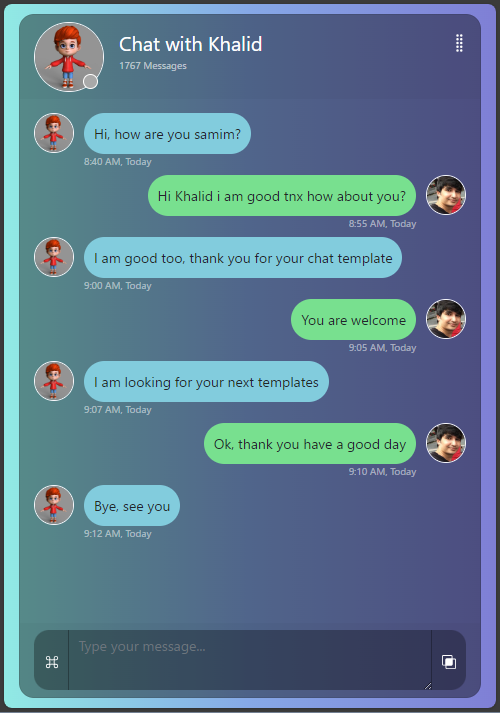

# HomeChatGPT（概要）
 
  （文字信息【略】）
  
## 需要提供个人 OpenAI API Key
> setx %openai_XXXXX% "penAI API Key"

## 运行
  此处的定义不是用于正式环境设置程序，而是为了快速搭建环境。
  请遵循正式设置程序进行环境搭建。因此，这里只记录注意事项，而非详细步骤。
  使用步骤：
  1. 安装WSL2，并在Windows上准备Docker运行环境
  2. 运行'docker-volume-create.bat'以创建容器卷
  3. 运行'boot_docker_postgres.bat'将执行容器映像的下载和启动过程
  
  之后，在此运行只需执行步骤 3
